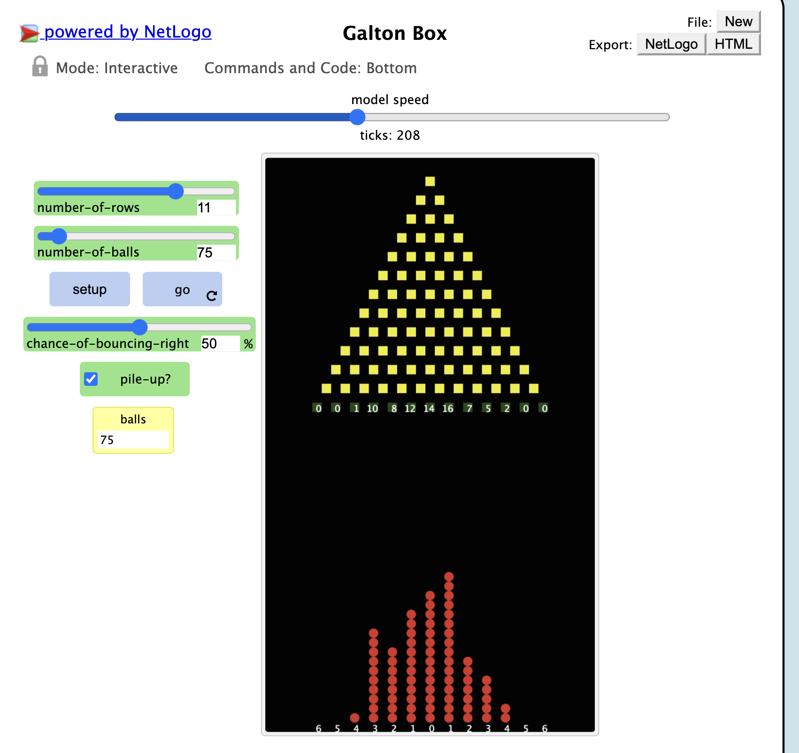
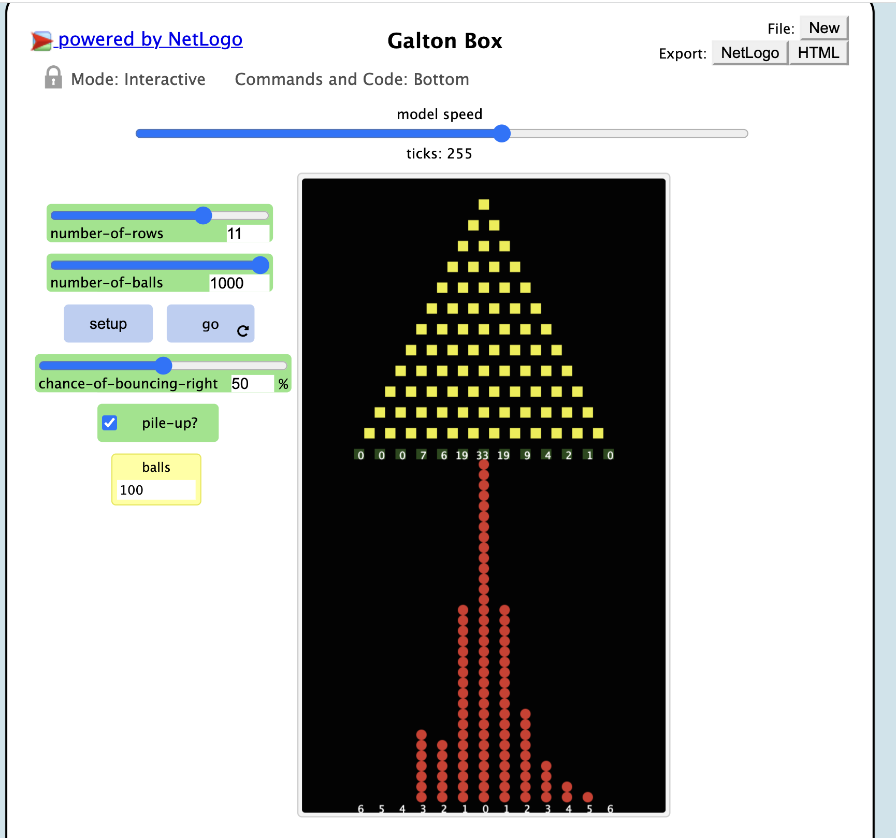
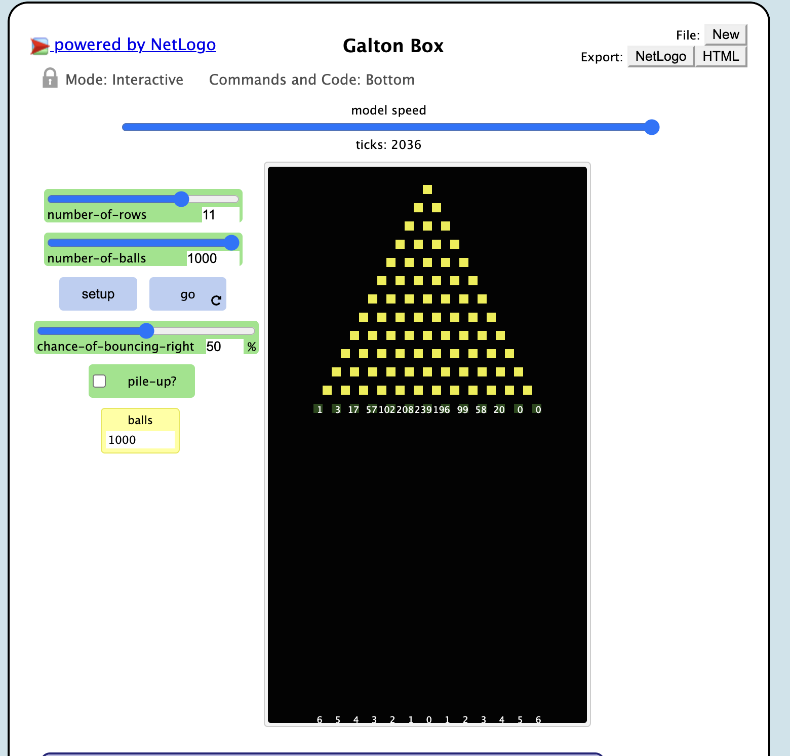
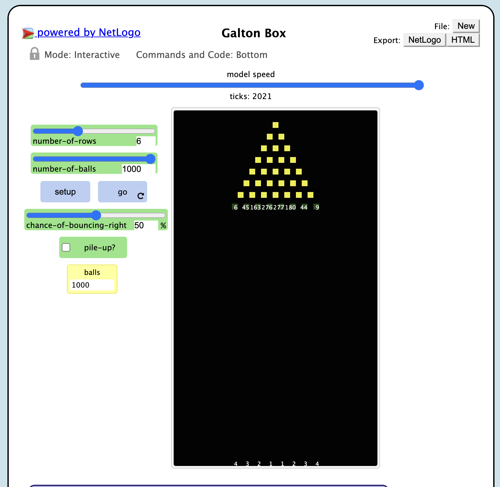
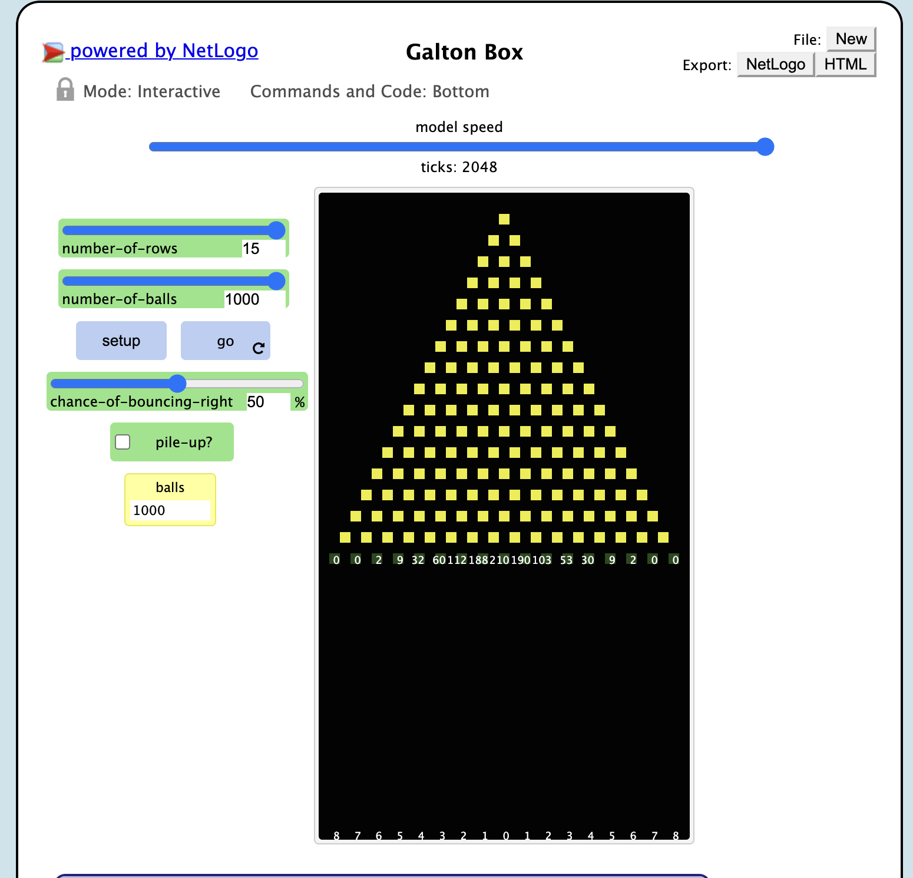
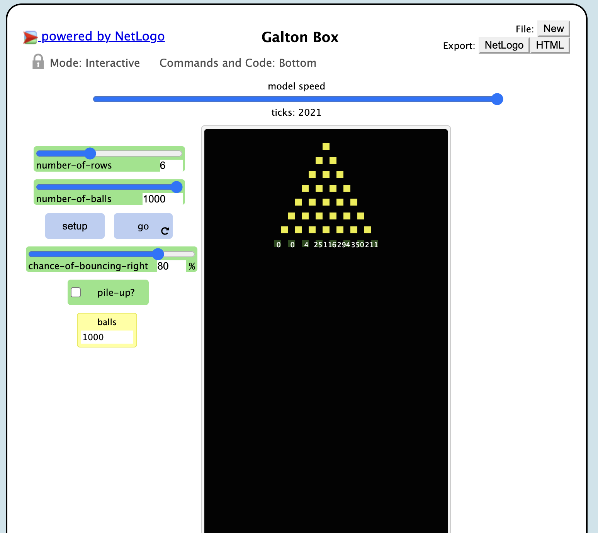
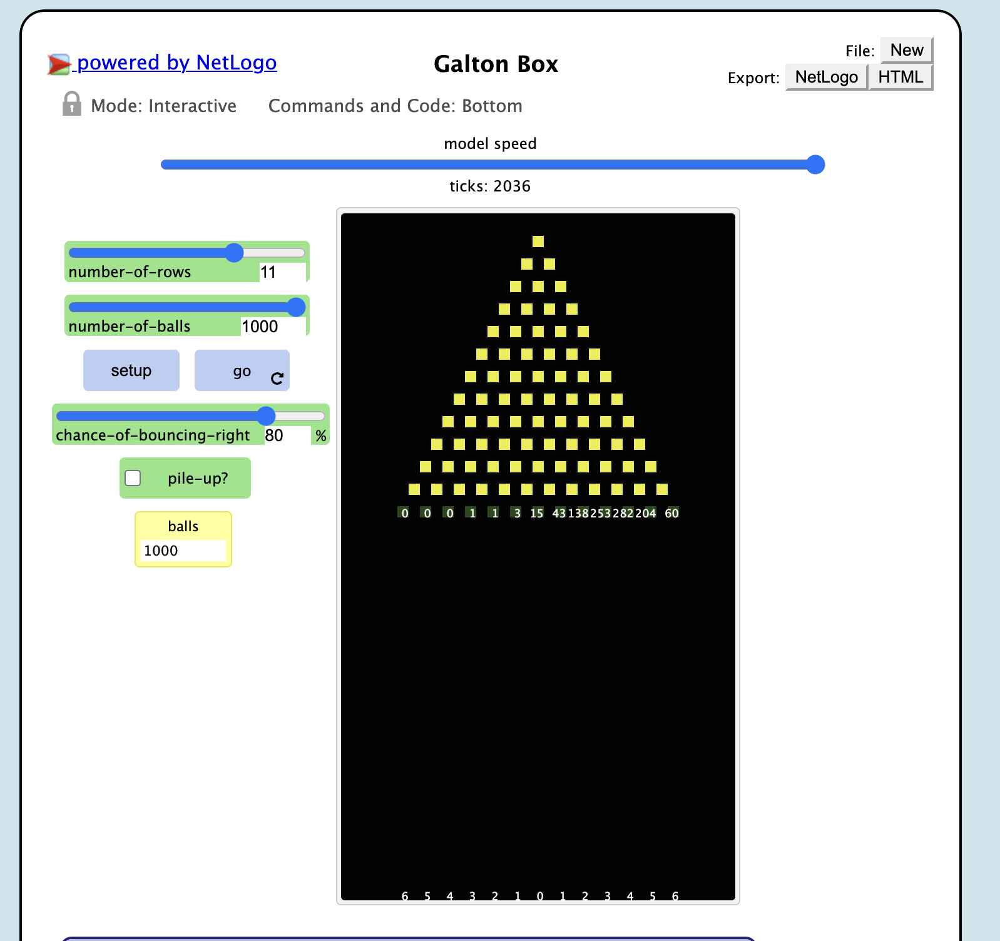
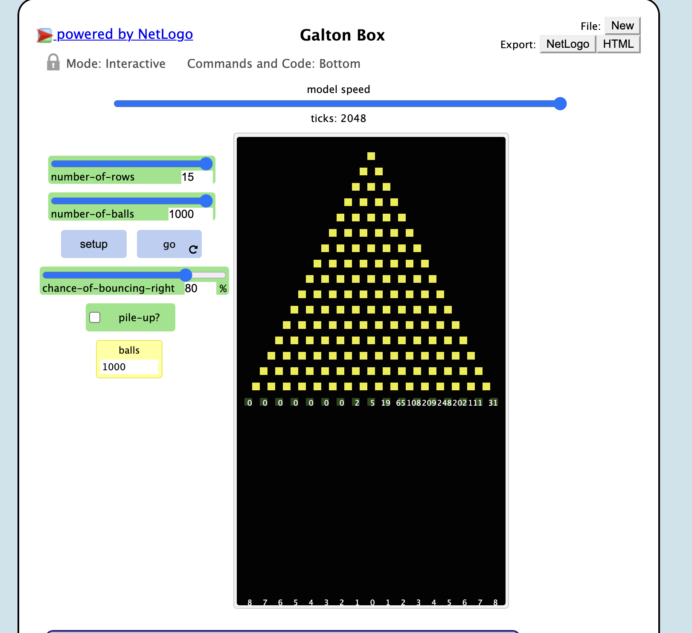

## Імітаційне моделювання комп'ютерних систем
## СПм-21-2, **Сергєєв Данило Андрійович**
### Лабораторная работа №**1**. Описание имитационных моделей

 

### Выбранная модель в среде NetLogo:
[Galton Box](http://www.netlogoweb.org/launch#http://www.netlogoweb.org/assets/modelslib/Sample%20Models/Mathematics/Probability/Galton%20Box.nlogo)

 

### Вербальное описание модели:
Galton Box - Коробка Гальтона представляет собой треугольную доску, содержащую несколько рядов расположенных в шахматном порядке штифтов, расположенных на одинаковом расстоянии друг от друга. Шары падают сверху, отскакивают от колышков и складываются в нижнюю часть треугольника. Полученные стопки шаров имеют характерную форму.
 
Модель позволяет вам наблюдать, как природа создает биномиальные коэффициенты из треугольника Паскаля и их связь с гауссовой колоколообразной нормальной кривой. Модель также может имитировать эксперименты по подбрасыванию монет с предвзятыми монетами, что приводит к искаженным распределениям.

### Управляющие параметры:
- **NUMBER-OF-ROWS** определеяет количество рядов
- **NUMBER-OF-BALLS** определеяет количество падающих шаров
- **CHANCE-OF-BOUNCING-RIGHT**  определяет вероятность, что шар будет падать вправо

### Внутренние параметры:
- **speed-of-sound** скорость звука
- **initial-wave-amplitude**. определяет насколько громкой является волна изначально
- **wave-interval** насколько часто самолет излучает волну

### Критерии эффективности системы:
- Практическое подтверждение Эффекта Доплера 

### Недостатки модели:
Движется только самолет

 

## Вычислительные эксперименты

### 1. Проведем эксперименты с заданными параметарами

По результату видно, что распределние шаров не соответсвуте комбинаторному просчету. Это связано в с малым количество шаров. Увеличим их до максимума (1000шт)
 

Эксперимент остановился на сотом шаре, так как шар поднялся до высоты коробки. Распределние шаров все также не соответсвует ожидаемому.
 
Уберем галочку "pile-up?", чтобы шары не накапливались, а просто велся подсчет.

<table>
<thead>
<tr><th>Количество рядом</th><th>Результат</th></tr>
</thead>
<tbody>
<tr><td>6</td><td>6-45-163-276-277-180-44-9</td></tr>
<tr><td>11</td><td>1-3-17-57-102-208-239-196-99-58-20-0-0</td></tr>
<tr><td>15</td><td>0-0-2-9-32-60-112-188-210-190-103-53-30-9-2-0-0</td></tr>
</tbody>
</table>

Результат: В каждом из случаев эксперимент подтвердил теорию о нормальном распределние 

### 2. Влияние увелечение вероятности падения шара вправо
Увеличим вероятность до 80%. Проведем, те же эксперементы

<table>
<thead>
<tr><th>Количество рядом</th><th>Результат</th></tr>
</thead>
<tbody>
<tr><td>6</td><td>0-0-4-25-116-294-350-211</td></tr>
<tr><td>11</td><td>0-0-0-1-1-3-15-43-138-253-282-204-60</td></tr>
<tr><td>15</td><td>0-0-0-0-0-0-0-2-5-19-65-108-209-248-202-111-31</td></tr>
</tbody>
</table>

### 3. Влияние увелечение вероятности падения шара вправо

Уменьшим вероятность до 20%. Проведем те же эксперименты

<table>
<thead>
<tr><th>Количество рядом</th><th>Результат</th></tr>
</thead>
<tbody>
<tr><td>6</td><td>185-357-316-113-24-4-1-0</td></tr>
<tr><td>11</td><td>73-196-278-246-127-55-18-6-1-0-0-0-0</td></tr>
<tr><td>15</td><td>25-110-210-248-207-121-53-16-9-1-0-0-0-0-0-0-0</td></tr>
</tbody>
</table>

Эксперимент наглядно показывает, что при увелечение вероятности распределение смещается вправо, а при уменьшении - влево. Поставив противоположные значения вероятностей (20 и 80), можно увидеть, что распределение получились зеркальны.
 
Эта модель является хорошим примером процесса независимых испытаний. Эксперимент наглядно показывает, как изменение вероятности влияет на смещение распределения, тем самым подтверждая комбинаторный анализ.
